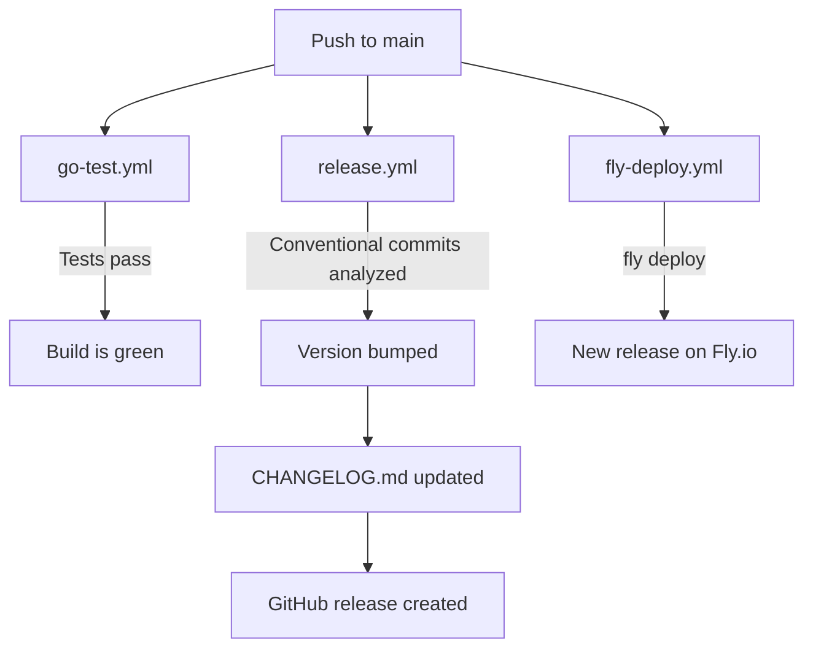

The project uses three GitHub Actions workflows to automate testing, releases, and deployment. All workflows are defined in `.github/workflows/`.

<CardGroup cols={3}>
  <Card title="go-test.yml" icon="flask">
    Runs the Go test suite on every push and pull request.
  </Card>
  <Card title="release.yml" icon="tag">
    Bumps the version, generates a changelog, and creates a GitHub release on push to `main`.
  </Card>
  <Card title="fly-deploy.yml" icon="cloud">
    Deploys the backend to Fly.io on every push to `main`.
  </Card>
</CardGroup>

## Workflows

### go-test.yml — run tests

This workflow runs the full Go test suite on every push to any branch and on every pull request. It ensures the build is always green before changes are merged.

```bash
go test ./... -v
```

**Triggers:** push to any branch, pull request

**What it does:**
- Checks out the repository.
- Sets up the Go toolchain.
- Runs `go test ./... -v` to execute all tests with verbose output.

<Tip>
  Keep the test suite passing on all branches. The `-v` flag surfaces individual test names and failure details in the Actions log, making it easier to debug failures in CI.
</Tip>

### release.yml — semantic release

This workflow automates versioning and changelog generation using [semantic-release](https://semantic-release.gitbook.io/semantic-release/). It reads your commit history to determine the next version number, updates `CHANGELOG.md`, and creates a tagged GitHub release.

**Triggers:** push to `main`

**Configuration file:** `.releaserc.json`

**What it does:**
1. Analyzes commits since the last release using conventional commit messages.
2. Determines the next semantic version (`major`, `minor`, or `patch`).
3. Generates or updates `CHANGELOG.md`.
4. Creates a GitHub release with release notes.
5. Tags the commit with the new version.

#### Conventional commits

semantic-release uses the [Conventional Commits](https://www.conventionalcommits.org/) specification to determine how to bump the version:

| Commit prefix | Version bump | Example |
|---------------|--------------|---------|
| `feat:` | Minor | `feat: add payment filtering by date` |
| `fix:` | Patch | `fix: correct amount rounding on create` |
| `chore:`, `docs:`, `style:`, `refactor:`, `test:` | None (patch) | `chore: update dependencies` |
| `BREAKING CHANGE:` (in footer) | Major | Any commit with `BREAKING CHANGE:` in the footer |

<Note>
  Commits that do not follow the conventional format are ignored by semantic-release and do not trigger a version bump.
</Note>

**Example commit messages:**

```bash
# Triggers a minor version bump
git commit -m "feat: add CSV export for payments"

# Triggers a patch version bump
git commit -m "fix: handle null recipient in response"

# Triggers a major version bump
git commit -m "feat!: replace REST with GraphQL API

BREAKING CHANGE: all existing REST endpoints are removed"
```

### fly-deploy.yml — deploy to Fly.io

This workflow deploys the Go backend to Fly.io on every push to `main`. It uses `flyctl` to build the Docker image and release the new version.

**Triggers:** push to `main`

**What it does:**
1. Checks out the repository.
2. Installs the `flyctl` CLI.
3. Authenticates using the `FLY_API_TOKEN` secret.
4. Runs `fly deploy` to build and release the backend.

## Required GitHub secrets

Add the following secrets to your repository under **Settings → Secrets and variables → Actions**:

| Secret | Required by | How to get it |
|--------|-------------|---------------|
| `FLY_API_TOKEN` | `fly-deploy.yml` | Run `fly auth token` locally |

<Warning>
  Without `FLY_API_TOKEN`, the `fly-deploy.yml` workflow will fail on every push to `main`. Set this secret before merging your first change.
</Warning>

## GoReleaser

The `.goreleaser.yml` file at the repository root configures [GoReleaser](https://goreleaser.com/) for building release binaries. GoReleaser can cross-compile the Go backend for multiple platforms and attach the binaries to GitHub releases.

GoReleaser is typically invoked as part of the release process — either manually or as an additional step in the `release.yml` workflow.

```bash
# Build release artifacts locally (dry run)
goreleaser build --snapshot --clean
```

## Deployment flow

The following diagram shows how the three workflows interact on a push to `main`:



<Note>
  `release.yml` and `fly-deploy.yml` run in parallel on push to `main`. A failed test run in `go-test.yml` does not block deployment — consider adding a `needs: test` dependency in `fly-deploy.yml` if you want deployment to gate on passing tests.
</Note>
