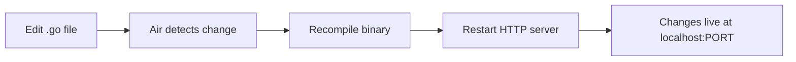

Docker is used at every stage of the project. During local development, Docker Compose orchestrates the Go backend and React frontend together. In production, the `Dockerfile` at the repository root builds a self-contained image of the Go backend for deployment.

## Local development with Docker Compose

The `compose.yml` file at the repository root defines two services: `app` (Go backend with live reload) and `frontend` (Vite dev server). Both services share a Docker network called `go_dashboard`.

### Prerequisites

<Columns cols={2}>
  <Card title="Docker" icon="docker" href="https://docs.docker.com/get-docker/">
    Docker Engine and Docker Compose v2 must be installed and running.
  </Card>
  <Card title=".env files" icon="file">
    A `.env` file in the repository root is required before starting the stack. See [Environment variables](/development/environment-variables).
  </Card>
</Columns>

### Starting the stack

<Steps>
  <Step title="Create your environment files">
    Copy `.env.example` to `.env` and fill in your values:

    ```bash
    cp .env.example .env
    ```

    Create the frontend environment file:

    ```bash
    cp frontend/.env.production frontend/.env
    ```

    Update `VITE_API_URL` in `frontend/.env` to point to your local backend:

    ```bash frontend/.env
    VITE_API_URL=http://localhost:8080
    ```
  </Step>

  <Step title="Start all services">
    ```bash
    docker compose up
    ```

    The first run downloads images and installs npm dependencies, so it takes a moment. Subsequent starts are faster.

    <Tip>
      Run `docker compose up -d` to start the stack in the background and keep your terminal free.
    </Tip>
  </Step>

  <Step title="Verify the services are running">
    | Service | URL |
    |---------|-----|
    | Go backend API | `http://localhost:<PORT>` (from `.env`) |
    | Frontend (Vite) | `http://localhost:5173` |

    Check the API health endpoint:

    ```bash
    curl http://localhost:8080/health
    # {"message":"App is running"}
    ```
  </Step>
</Steps>

### Services

<AccordionGroup>
  <Accordion title="app — Go backend (cosmtrek/air)" defaultOpen={true}>
    The `app` service runs the Go application using [Air](https://github.com/cosmtrek/air), a live-reload tool for Go. When you edit any `.go` file under `cmd/` or `internal/`, Air detects the change, recompiles the binary, and restarts the HTTP server automatically — no container restart needed.

    **Image:** `cosmtrek/air`

    **Port:** Configurable via the `PORT` environment variable.

    **Environment variables passed to the container:**

    ```yaml
    APP_ENV: ${APP_ENV}
    PORT: ${PORT}
    DB_HOST: ${DB_HOST}
    DB_PORT: ${DB_PORT}
    DB_DATABASE: ${DB_DATABASE}
    DB_USERNAME: ${DB_USERNAME}
    DB_PASSWORD: ${DB_PASSWORD}
    DB_SCHEMA: ${DB_SCHEMA}
    DB_SSLMODE: ${DB_SSLMODE}
    ```

    **Volume mounts:**

    | Host path | Container path | Purpose |
    |-----------|---------------|---------|
    | `./cmd` | `/dashboard/cmd` | Application entrypoint |
    | `./internal` | `/dashboard/internal` | Handlers, business logic, database layer |
    | `./go.mod` | `/dashboard/go.mod` | Module definition |
    | `./go.sum` | `/dashboard/go.sum` | Dependency checksums |
    | `./.air.toml` | `/dashboard/.air.toml` | Air live-reload configuration |
    | `./.env` | `/dashboard/.env` | Runtime environment variables |
  </Accordion>

  <Accordion title="frontend — Vite dev server (node:25-alpine)">
    The `frontend` service serves the React application using the Vite development server.

    **Image:** `node:25-alpine`

    **Port:** `5173` (fixed)

    **Startup command:**
    ```bash
    npm install && npm run dev
    ```

    The `node_modules` directory is excluded from the host volume mount via an anonymous volume (`/frontend/node_modules`), keeping host and container dependencies independent.

    The service declares a `depends_on` relationship with `app`, so Docker Compose starts the backend before the frontend.
  </Accordion>
</AccordionGroup>

### Live reload workflow

When you edit a Go file, Air handles the full recompile-restart cycle inside the running container:



<Note>
  Air's configuration lives in `.air.toml` at the project root. You can adjust watched directories, build commands, and exclusion patterns there.
</Note>

### Common operations

<CodeGroup>

```bash Stop the stack
docker compose down
```

```bash Rebuild images
docker compose up --build
```

```bash View all logs
docker compose logs -f
```

```bash View logs for a single service
docker compose logs -f app
```

```bash Restart a single service
docker compose restart app
```

</CodeGroup>

<Warning>
  `docker compose down` removes containers but preserves named volumes. To remove volumes as well (e.g. a local database volume), run `docker compose down -v`.
</Warning>

## Production Dockerfile

The `Dockerfile` at the repository root builds a production image of the Go backend. It is used by the [Fly.io deployment](/deployment/fly-io) and can be used to run the backend anywhere that supports Docker.

### Build the image

```bash
docker build -t go-dashboard .
```

### Run the production image locally

```bash
docker run --env-file .env -p 8080:8080 go-dashboard
```

<Note>
  The production image runs the compiled Go binary directly — it does not use Air or any live-reload tooling. Use Docker Compose with the `cosmtrek/air` image for development.
</Note>

## Environment variable differences

The table below highlights the key differences between local and production configuration:

| Variable | Local (development) | Production |
|---|---|---|
| `APP_ENV` | `development` | `production` |
| `DB_HOST` | `db` (Compose service name) | Managed database hostname |
| `DB_SSLMODE` | `disable` | `require` or `verify-full` |
| `FRONTEND_ORIGIN` | `http://localhost:5173` | Your deployed frontend URL |

<Warning>
  Never use `DB_SSLMODE=disable` in production. Set it to `require` or `verify-full` to encrypt the database connection.
</Warning>
