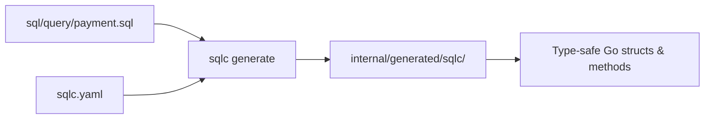

The Go Payment Dashboard uses PostgreSQL as its database. SQL migrations define the schema, and [sqlc](https://sqlc.dev) generates type-safe Go code from hand-written SQL queries.

## Schema

The database contains a single `payments` table.

### payments

| Column | Type | Constraints | Description |
|--------|------|-------------|-------------|
| `id` | `SERIAL` | `PRIMARY KEY` | Auto-incrementing payment identifier |
| `sender` | `VARCHAR(255)` | `NOT NULL` | Name or identifier of the payment sender |
| `recipient` | `VARCHAR(255)` | `NOT NULL` | Name or identifier of the payment recipient |
| `amount` | `DECIMAL(10, 2)` | `NOT NULL` | Payment amount (up to 99,999,999.99) |
| `created_at` | `TIMESTAMP` | `NOT NULL`, default `CURRENT_TIMESTAMP` | Record creation time |
| `updated_at` | `TIMESTAMP` | `NOT NULL`, default `CURRENT_TIMESTAMP` | Last update time |

## Migrations

Migration files are plain SQL located in `sql/migration/`.

<Tree>
  <Tree.Folder name="sql" defaultOpen>
    <Tree.Folder name="migration" defaultOpen>
      <Tree.File name="payment.sql" />
    </Tree.Folder>
    <Tree.Folder name="query" defaultOpen>
      <Tree.File name="payment.sql" />
    </Tree.Folder>
  </Tree.Folder>
</Tree>

### payment.sql

```sql sql/migration/payment.sql
CREATE TABLE payments (
    id SERIAL PRIMARY KEY,
    sender VARCHAR(255) NOT NULL,
    recipient VARCHAR(255) NOT NULL,
    amount DECIMAL(10, 2) NOT NULL,
    created_at TIMESTAMP DEFAULT CURRENT_TIMESTAMP NOT NULL,
    updated_at TIMESTAMP DEFAULT CURRENT_TIMESTAMP NOT NULL
);
```

### Applying migrations

The project does not use an automated migration runner. Apply migrations manually using `psql` or `docker exec`.

<CodeGroup>

```bash Using psql
psql -h localhost -p 5432 -U postgres -d payments_db -f sql/migration/payment.sql
```

```bash Using docker exec
docker exec -i <db-container-name> psql -U postgres -d payments_db < sql/migration/payment.sql
```

</CodeGroup>

<Note>
  Replace `<db-container-name>` with the name of your running PostgreSQL container. Use `docker ps` to find it.
</Note>

## sqlc

[sqlc](https://sqlc.dev) reads your SQL query files and `sqlc.yaml` config, then generates idiomatic, type-safe Go code. You write SQL; sqlc writes the boilerplate.

### How it works



### Queries

All payment queries are defined in `sql/query/payment.sql`.

```sql sql/query/payment.sql
-- name: GetPaymentByID :one
SELECT * FROM payments WHERE id = $1 LIMIT 1;

-- name: GetPayments :many
SELECT * FROM payments ORDER BY created_at DESC;

-- name: CreatePayment :one
INSERT INTO payments (sender, recipient, amount) VALUES ($1, $2, $3) RETURNING *;
```

| Query name | Return mode | Description |
|------------|-------------|-------------|
| `GetPaymentByID` | `:one` | Fetch a single payment by its primary key |
| `GetPayments` | `:many` | List all payments ordered by creation date (newest first) |
| `CreatePayment` | `:one` | Insert a new payment and return the created record |

### sqlc.yaml

The `sqlc.yaml` file at the project root configures code generation — it specifies the database engine, the location of query and migration files, and the output package path.

```yaml sqlc.yaml
# Example configuration — refer to your actual sqlc.yaml for exact values
version: "2"
sql:
  - engine: "postgresql"
    queries: "sql/query/"
    schema: "sql/migration/"
    gen:
      go:
        package: "sqlc"
        out: "internal/generated/sqlc"
```

### Regenerating code

Run `sqlc generate` after modifying any file in `sql/query/` or `sql/migration/`.

```bash
sqlc generate
```

The updated Go files are written to `internal/generated/sqlc/`. Commit both the SQL files and the generated Go files.

<Warning>
  Do not manually edit files inside `internal/generated/sqlc/`. They are overwritten on every `sqlc generate` run.
</Warning>

## Integration tests

Integration tests for the database layer live in `internal/database` and use [testcontainers-go](https://golang.testcontainers.org/) with the `postgres` module. Each test run spins up a real PostgreSQL container, applies the schema, runs the test, then tears the container down automatically.

<Note>
  Docker must be running on your machine for integration tests to work. The tests pull the PostgreSQL image on first run if it is not already cached.
</Note>

### Running integration tests

```bash
go test ./internal/database -v
```

The `-v` flag shows per-test output including container startup logs, which is useful for debugging.

<Tip>
  No manual database setup is needed for integration tests. testcontainers-go handles provisioning and cleanup automatically.
</Tip>
