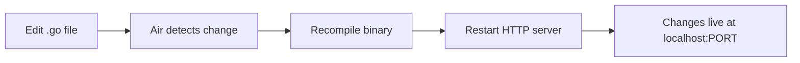

The development stack runs entirely in Docker Compose. The backend uses [Air](https://github.com/cosmtrek/air) for live reload, so Go file changes are picked up automatically without restarting the container.

## Prerequisites

<Columns cols={3}>
  <Card title="Docker" icon="docker" href="https://docs.docker.com/get-docker/">
    Docker Engine and Docker Compose v2 must be installed and running.
  </Card>
  <Card title="Go 1.25.5" icon="code">
    Required if you want to run Go tooling (e.g. sqlc, tests) outside of Docker.
  </Card>
  <Card title="Node.js" icon="square-terminal">
    Required only if you run the frontend outside Docker. The Compose stack uses node:25-alpine.
  </Card>
</Columns>

## Starting the stack

<Steps>
  <Step title="Clone the repository">
    ```bash
    git clone <repository-url>
    cd go-dashboard
    ```
  </Step>

  <Step title="Create your .env file">
    Copy the example environment file and fill in your values.

    ```bash
    cp .env.example .env
    ```

    See the [Environment variables](/development/environment-variables) reference for a description of every field.
  </Step>

  <Step title="Start all services">
    ```bash
    docker compose up
    ```

    Docker Compose starts the `app` (Go backend) and `frontend` (Vite) services. The frontend service runs `npm install` on first boot, so the initial startup takes a moment.

    <Tip>
      Run `docker compose up -d` to start the stack in the background and free your terminal.
    </Tip>
  </Step>

  <Step title="Verify the services are running">
    | Service | URL |
    |---------|-----|
    | Backend API | `http://localhost:<PORT>` (value from `.env`) |
    | Frontend (Vite) | `http://localhost:5173` |
  </Step>
</Steps>

## Services

<AccordionGroup>
  <Accordion title="app — Go backend (cosmtrek/air)" defaultOpen={true}>
    The `app` service runs the Go application using [Air](https://github.com/cosmtrek/air), a live-reload tool for Go.

    **Image:** `cosmtrek/air`

    **Port:** Configurable via the `PORT` environment variable.

    **Volume mounts:**

    | Host path | Container path | Purpose |
    |-----------|---------------|---------|
    | `./cmd` | `/dashboard/cmd` | Application entrypoint |
    | `./internal` | `/dashboard/internal` | Business logic, handlers, database layer |
    | `./go.mod` | `/dashboard/go.mod` | Module definition |
    | `./go.sum` | `/dashboard/go.sum` | Dependency checksums |
    | `./.air.toml` | `/dashboard/.air.toml` | Air live-reload configuration |
    | `./.env` | `/dashboard/.env` | Runtime environment variables |

    Editing any `.go` file under `cmd/` or `internal/` triggers Air to recompile and restart the server automatically.
  </Accordion>

  <Accordion title="frontend — Vite dev server (node:25-alpine)">
    The `frontend` service serves the React application using the Vite development server.

    **Image:** `node:25-alpine`

    **Port:** `5173` (fixed)

    **Startup command:**
    ```bash
    npm install && npm run dev
    ```

    The `node_modules` directory is excluded from the host volume mount via an anonymous volume, so host and container dependencies stay independent.

    The service depends on `app`, so Docker Compose starts the backend first.
  </Accordion>
</AccordionGroup>

## Live reload workflow

When you edit a Go file, Air detects the change, recompiles the binary, and restarts the HTTP server — all inside the running container. You do not need to run `docker compose restart`.



<Note>
  Air's configuration lives in `.air.toml` at the project root. Adjust build commands, watched directories, or exclusion patterns there.
</Note>

## Common operations

<CodeGroup>

```bash Stop the stack
docker compose down
```

```bash Rebuild images
docker compose up --build
```

```bash View logs
docker compose logs -f
```

```bash View logs for a single service
docker compose logs -f app
```

```bash Restart a single service
docker compose restart app
```

</CodeGroup>

<Warning>
  `docker compose down` removes the containers but preserves named volumes. If you want to remove volumes as well (e.g. a local database volume), run `docker compose down -v`.
</Warning>
