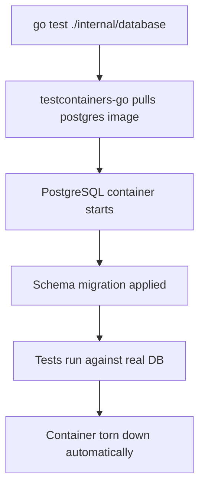

The Go Payment Dashboard has two categories of tests: unit tests for handler logic and integration tests for the database layer. Integration tests use [testcontainers-go](https://golang.testcontainers.org/) to spin up a real PostgreSQL instance automatically — no manual database setup is required.

## Test categories

<Columns cols={2}>
  <Card title="Unit tests" icon="flask-conical">
    Test individual handlers and business logic in isolation. No external dependencies required. Located in `internal/api/`.
  </Card>
  <Card title="Integration tests" icon="database">
    Test the full database layer against a real PostgreSQL container. Docker must be running. Located in `internal/database/`.
  </Card>
</Columns>

## Running tests

### All tests

Run every test in the module:

```bash
go test ./... -v
```

The `./...` pattern matches all packages recursively. The `-v` flag prints each test name and its pass/fail status as it runs.

<Warning>
  Running `./...` includes the integration tests in `internal/database`, which require Docker to be running. If Docker is not available, those tests will fail. Run only unit tests by targeting specific packages (see below).
</Warning>

### Integration tests only

```bash
go test ./internal/database -v
```

This targets the `internal/database` package directly and runs its integration tests against a PostgreSQL container managed by testcontainers-go.

### Unit tests only

To run only the payment handler unit tests without touching the database:

```bash
go test ./internal/api -v
```

## Unit tests

### Payment handler tests

The payment handler test file is located at `internal/api/payment_test.go`. These tests cover the HTTP handler logic — request parsing, response serialization, and error handling — without a live database.

```bash
go test ./internal/api -v -run TestPayment
```

<Tip>
  Use `-run <regex>` to execute a specific test or subset of tests by name pattern.
</Tip>

## Integration tests

Integration tests in `internal/database` verify that the sqlc-generated queries work correctly against a real PostgreSQL database.

### How testcontainers-go works



Each test run gets a fresh container. There is no shared state between runs, and no cleanup is needed after tests finish.

### Prerequisites

<AccordionGroup>
  <Accordion title="Docker must be running" defaultOpen={true}>
    testcontainers-go uses the Docker daemon to create and manage containers. Start Docker Desktop (macOS/Windows) or the Docker service (Linux) before running integration tests.

    ```bash
    docker info
    ```

    If the command succeeds, Docker is ready.
  </Accordion>

  <Accordion title="PostgreSQL image">
    testcontainers-go pulls the PostgreSQL image automatically on the first run. Subsequent runs use the cached image.

    To pre-pull the image manually:

    ```bash
    docker pull postgres
    ```
  </Accordion>
</AccordionGroup>

### Running integration tests

```bash
go test ./internal/database -v
```

Expect output similar to:

```
=== RUN   TestGetPayments
--- PASS: TestGetPayments (2.31s)
=== RUN   TestCreatePayment
--- PASS: TestCreatePayment (1.84s)
PASS
ok      go-dashboard/internal/database  4.153s
```

<Note>
  The first run takes longer because Docker pulls the PostgreSQL image. Subsequent runs are faster.
</Note>

## Test flags reference

| Flag | Description | Example |
|------|-------------|--------|
| `-v` | Verbose output — print each test name as it runs | `go test ./... -v` |
| `-run <regex>` | Run only tests whose names match the regex | `go test ./... -run TestCreate` |
| `-count=1` | Disable test result caching, always re-run | `go test ./... -count=1` |
| `-timeout <duration>` | Override the default 10-minute test timeout | `go test ./... -timeout 5m` |
| `-short` | Signal tests to skip long-running operations (if supported) | `go test ./... -short` |
